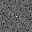
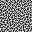
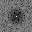
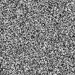
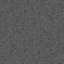
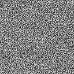
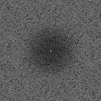
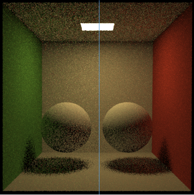

# Blue Noise

by [Duan Gao](https://gao-duan.github.io/)

Implement the algorithm introduced in [1].

The blue noise image can be used in Path Tracing to distribute the Monte Carlo noise from white noise to blue noise (I have tested this idea in my own physically based renderer [Elegans](https://github.com/gao-duan/Elegans)) , more details are described in [2]. 

**Update[2020-01-06]**

- Add Python binding support (via [pybind11](https://github.com/pybind/pybind11/tree/98f1bbb8004f654ba9e26717bdf5912fb899b05a))
- Add support for generating multiple dimensional blue noise texture. (e.g 2D/3D blue noise texture)

## Dependencies

- [CImg](https://github.com/dtschump/CImg)
- OpenMP support
- C++ 11
- [pybind11](https://github.com/pybind/pybind11)
- [pbar](https://github.com/Jvanrhijn/pbar)

## Results

1D blue-noise:

| Resolution | White noise                       | White noise FFT [3]           | Blue noise | Blue noise FFT |
| ---------- | --------------------------------- | -------------------------------------- | ---------- | -------------- |
| 32x32      |  |  |               |             |
| 128x128    |  |       |            |                |

 

Here we show the path tracing results comparison of Cornell Box (only 1spp) :

> Here I just implement the sorting scheme introduced in the slides [4].
>
> - sorting all the radiances of same pixel;
> - pick the radiance according to the blue noise value in the same pixel position.

[1] Georgiev I, Fajardo M. Blue-noise dithered sampling[C]//ACM SIGGRAPH 2016 Talks. ACM, 2016: 35.

https://www.arnoldrenderer.com/research/dither_abstract.pdf

[2] Heitz E, Belcour L. Distributing Monte Carlo Errors as a Blue Noise in Screen Space by Permuting Pixel Seeds Between Frames[C]//Computer Graphics Forum. 2019, 38(4): 149-158.

https://hal.archives-ouvertes.fr/hal-02158423/document

[3] Use ./results/vis_image_freq.py to generate the frequency visualization image. Please see [OpenCV](https://docs.opencv.org/3.0-beta/doc/py_tutorials/py_imgproc/py_transforms/py_fourier_transform/py_fourier_transform.html) for more details.

[4] https://hal.archives-ouvertes.fr/hal-02158423/file/blueNoiseTemporal2019_slides.pdf
